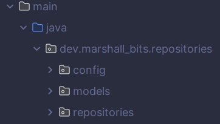

# RetoBit: Repositorios 👷‍♀️

En este RetoBit vamos a practicar el uso de JPA y JPQL para crear repositorios que nos permitan interactuar con una base de datos. Tu Tech Lead te ha puesto a cargo de los repositorios de la aplicación. 

No hay que preocuparse por la base de datos, ya que está todo planeado para generar una base de datos ficticia en memoria y no hace falta que la configures. 

## ¿Qué practicarás?

- Creación de repositorios JPA
- Métodos de consulta derivados de `JpaRepository`
- JPQL (Java Persistence Query Language)
- TDD (Test Driven Development)

## Fork del repositorio:

Haz un fork del repo.

Pulsa el botón Fork en github:


Esto creará una copia del repositorio en tu perfil de Github.

## Clona el repo en tu computadora

Ahora hay que descargarse el proyecto en tu computadora.

### 1. Asegúrate de que estás en la URL de TU copia del repositorio

Si la URL es esta: https://github.com/curso-java-marshall-bits/retobit-repositories-JPA **NO ES CORRECTO**.

Donde aparece 'curso-java-marshall-bits' debería aparecer tu nombre de usuario. Haz click en tu perfil y mira tus
repositorios para comprobar si hiciste el fork. En caso contrario vuelve al paso anterior.

### 2. Pulsa en "code" para ver la URL del repositorio y cópiala


Para ello deberás abrir una terminal y navegar a la carpeta donde quieras añadir este retoBit.

Utiliza el siguiente comando:

```commandline
git clone https://aqui.debes.pegar.la.url
```

**Nota: Después del 'git clone' debes pegar la url del repositorio. No pongas la que he puesto yo en el ejemplo 🤣*

Ahora se va a crear un nuevo directorio con el nombre del retoBit.

### 3. ¡Ya puedes abrir este reto en IntelliJ!

# Instrucciones

## Tarea 1: Crea un package

Genera el Package `repositories` dentro de `src/main/java/dev.marshall_bits.repositories`.



## Tarea 2: Crea los repositorios

Dentro del package `repositories` crea los siguientes repositorios:

- `UserRepository`: para gestionar los usuarios.
- `PostRepository`: para gestionar las publicaciones.
- `CategoryRepository`: para gestionar las categorías de cada publicación.

## Tarea 3: Implementa métodos de consulta findBy

Para cada repositorio, implementa los siguientes métodos derivados de la interfaz `JpaRepository` que empiezan con
`findBy`:

- `UserRepository`:
    - Método para buscar un usuario por su nombre de usuario.
    - Método para buscar un usuario por su correo electrónico.

<details>
<summary>Pista 🕵️‍♀️</summary>
Para implementar estos métodos, utiliza la convención de nomenclatura de Spring Data JPA. Por ejemplo, para buscar un coche por su marca, el método podría llamarse `findByBrand(String brand)`.
</details>

- `PostRepository`:
    - Método para buscar una publicación por su título.
    - Método para buscar publicaciones por categoría, devuelve una lista de posts. **Ten en cuenta que la categoría es un ENUM*.

<details>
<summary>Pista 🕵️‍♀️</summary>
Puedes utilizar como argumento cualquier tipo de dato, ya sea String, Integer o Enum.
</details>

## Tarea 4: Implementa consultas JPQL
Para cada repositorio, implementa los siguientes métodos utilizando JPQL. A pesar de que algunos se pueden implementar con consultas derivadas, vamos a hacerlo con JPQL para practicar.
Puedes ayudarte con una IA usando el siguiente prompt:

```text
Crea un método en un repositorio de Spring Data JPA que utilice JPQL para realizar una consulta compleja. El método debe devolver una lista de objetos que cumplan con ciertos criterios.
```
Trata de que la IA no te dé el código completo, sino que te ayude a entender cómo hacer la consulta.

Métodos a implementar:
 
- `PostRepository`:
    - Método para obtener una lista de posts que tengan más de 100 vistas. Llámalo `findPostsWithMoreThan100Views()`.
    - Método para obtener una lista de publicaciones ordenadas por fecha de creación, desde la más reciente a la más antigua. Llámalo `findAllByCreatedAt()`.
    - Método para obtener una lista de publicaciones que contengan una palabra clave en su título. Llámalo `findByTitleContaining(String keyword)`. 

## Testing

Para comprobar si has realizado bien el ejercicio ejecuta los tests. Pulsa con el botón derecho en el directorio *
**src/test/java** seleccionando la opción 'Run all tests'. También puedes ejecutar los tests para cada tarea seleccionando el archivo específico.

- **src/test/java/Task2RepositoryCreationTest**: para comprobar que has creado los repositorios correctamente.
- **src/test/java/Task3FindByMethodsTest**: para comprobar que has implementado correctamente los métodos de consulta derivados de `JpaRepository`.
- **src/test/java/Task4JPQLQueriesTest**: para comprobar que has implementado correctamente las consultas JPQL.

El test te indicará si has pasado con un tick verde ✅. En caso contrario verás el error.

Ejemplo:


Pulsa en cualquiera de los tests que has fallado y mira el mensaje de la derecha.

- *Expected*: es el valor que el test estaba esperando.
- *Actual*: es el valor que tu reto está retornando.

## Solución

Si quieres ver una posible solución para el retoBit que pasa todos los tests puedes mirar la rama *solution* dentro del
repositorio.


Ten en cuenta que hay muchas formas de resolver los ejercicios y la tuya puede pasar los tests iguales, pero ser
completamente distinta a la solución. No significa que la tuya esté mal. Compara los resultados y decide cuál te gusta
más o te parece más legible.

## Entrega

Realiza un commit con los cambios desde la terminal:

1. Añade todos los cambios

````commandline
git add .
````

2. Haz el commit con el mensaje

````commandline
git commit -m "retobit finalizado"
````

3. Haz un push

````commandline
git push origin main
````

Debes realizar una pull request para entregar el ejercicio. Abre el link del repositorio en github y haz click en la
pestaña *pull requests*.

Selecciona *New pull request*, *Create pull request* y confírmala. Esto hará que yo pueda verlo y revisarlo en caso de
que haya fallado algún test para poder darte feedback.

Mucha suerte con el reto. Te mando un abrazo y ¡Sigamos desarrollando! 🫂

[marshall-bits.dev](http://marshall-bits.dev)

*Nota: Estos retos pertenecen al curso de Marcel Bosch de Java para desarrolladores junior. Cualquier uso fuera de este
contexto debe estar autorizado explícitamente. Si quieres usar estos ejercicios ponte en contacto conmigo a través de
mis redes sociales (visita mi página para [más información](http://marshall-bits.dev)).* 